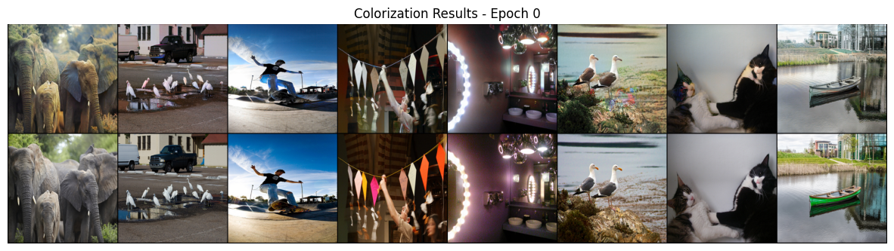
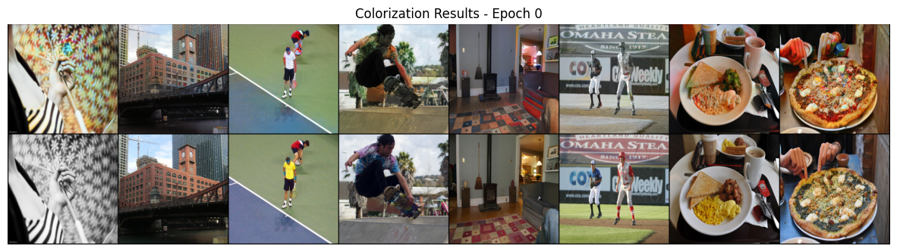

# Image Colorization with Pix2Pix

An implementation of the [Pix2Pix](https://arxiv.org/abs/1611.07004) paper for image colorization using PyTorch.  
Try a trained on Google Colab:  

<a href="https://colab.research.google.com/github/DavidRamosArchilla/Colorizing-images/blob/main/image_colorization_demo.ipynb" target="_parent"></a>


## Overview

This project applies conditional adversarial networks to colorize grayscale images. The model learns to translate grayscale images into colorful ones by training on paired datasets.

## Features

- Implemented in PyTorch
- Supports custom datasets
- Includes a training script and a jupyter notebook on google colab to test a trained model hosted on huggingface model hub.
- Data augmentation and preprocessing
- Logging to tensorboard

## Training details
It has been trained with 12000 images from [COCO 2017 dataset](https://cocodataset.org/) during 150 epochs with batch size 16 and learning rate 2e-4 for both generator and discriminator. Data augmentation is done by randomly flipping horizontally the images. 

## Installation

```bash
git clone https://github.com/yourusername/colorizing_images.git
cd colorizing_images
pip install -r requirements.txt
```

## Usage

### Training

```bash
python train.py
```

## Results

Here are some examples of colorized images, the upper row are the generations of the model:




## Acknowledgments

- The original [Pix2Pix paper](https://arxiv.org/abs/1611.07004)
- [PyTorch](https://pytorch.org/) framework
- [HuggingFace🤗](https://huggingface.co/) Model Hub

## License

This project is licensed under the MIT License.
